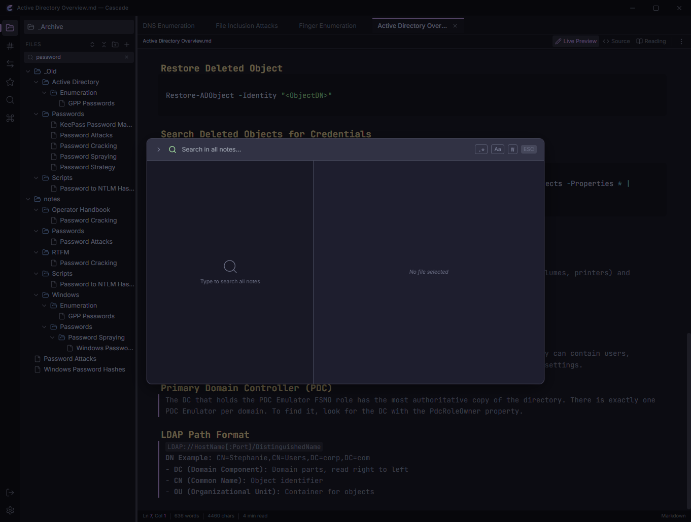
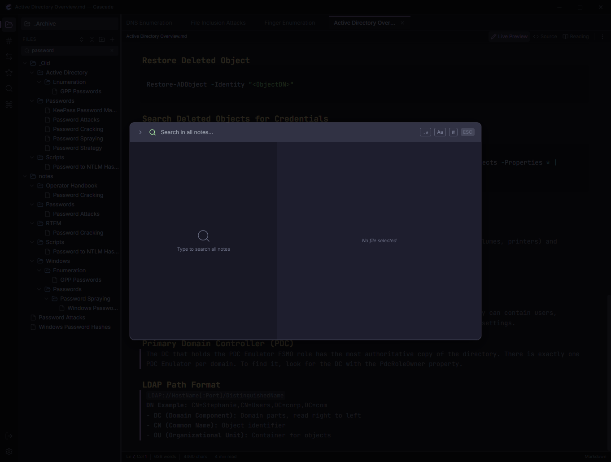
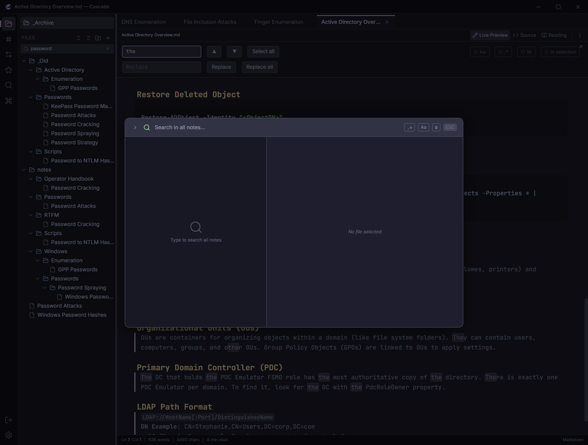
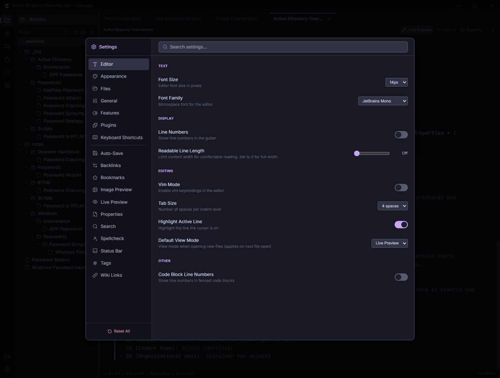
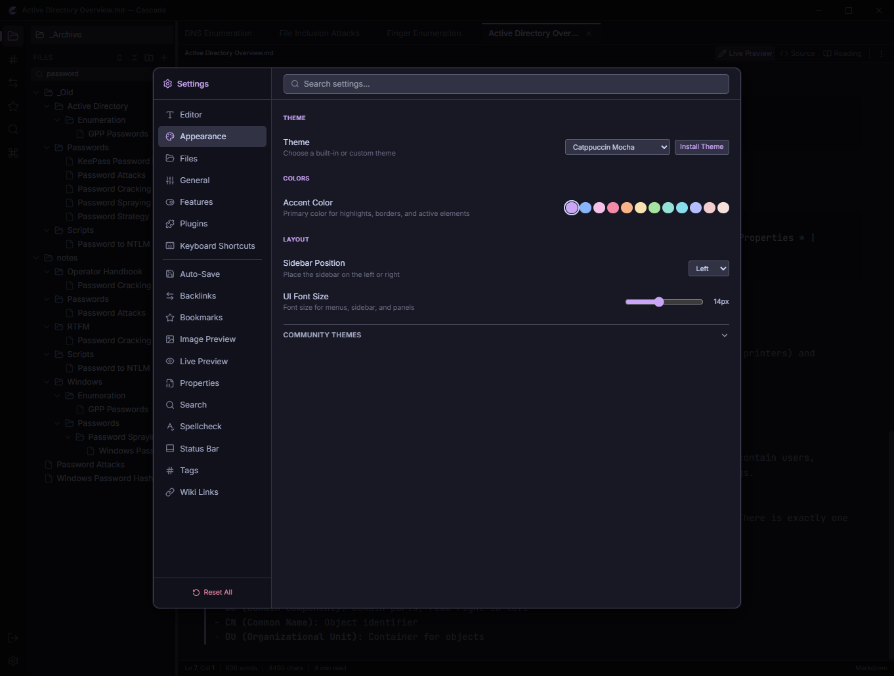
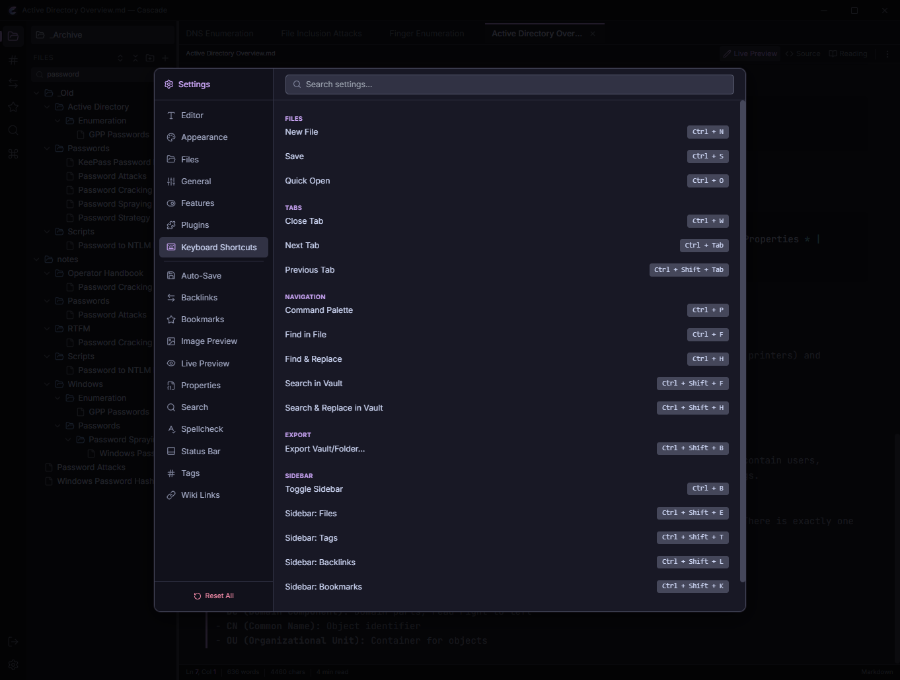
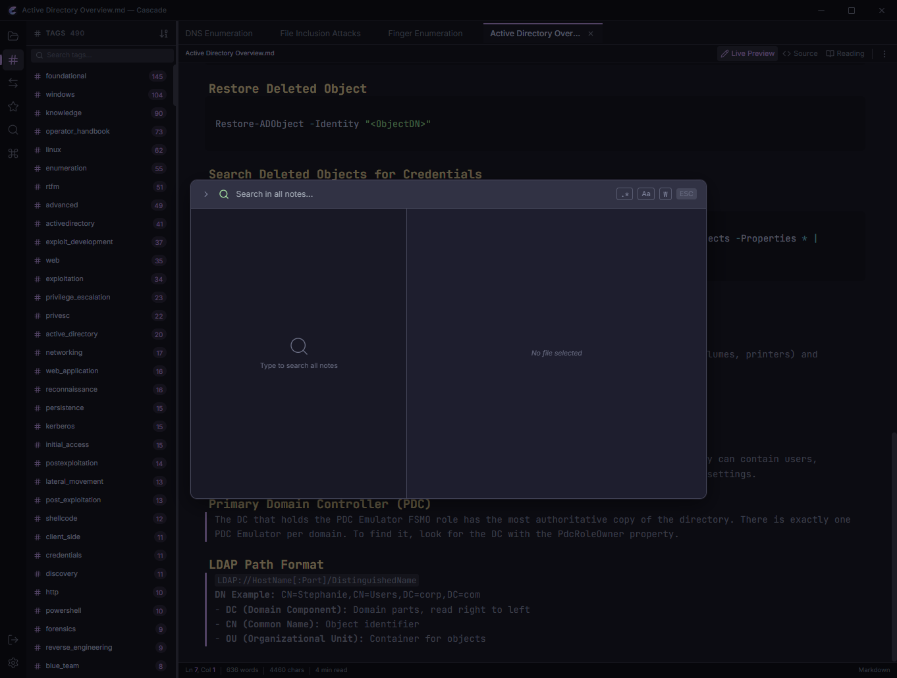
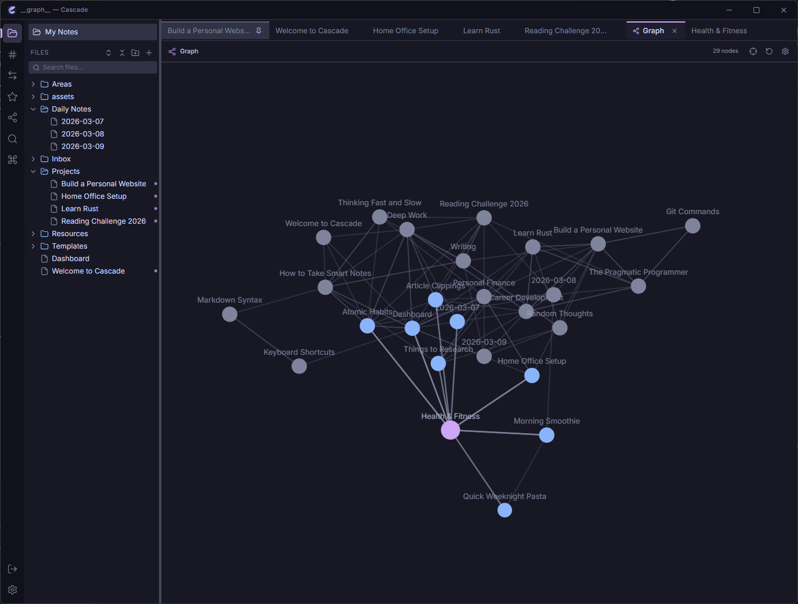

<p align="center">
  
</p>

<h1 align="center">Cascade</h1>

<p align="center">
  A fast, beautiful markdown note-taking app for personal knowledge management.
  <br />
  Built with Tauri, React, and CodeMirror.
</p>

<p align="center">
  <a href="#features">Features</a> &bull;
  <a href="#screenshots">Screenshots</a> &bull;
  <a href="#installation">Installation</a> &bull;
  <a href="#development">Development</a> &bull;
  <a href="#license">License</a>
</p>

---

## Features

**Editor**
- Live Preview, Source, and Reading view modes
- CodeMirror 6 with syntax highlighting, code folding, and bracket matching
- Wiki-links (`[[note]]`) with autocomplete and backlink tracking
- YAML frontmatter properties editor
- Inline image and PDF preview
- Find and replace across notes (Ctrl+Shift+F)
- Spellcheck with custom dictionary support
- Vim mode (optional)

**Knowledge Management**
- Backlinks panel showing all notes that link to the current note
- Tag index with tag panel for browsing
- Graph view visualizing connections between notes
- Bookmarks for quick access to frequently used notes
- Outline panel for heading navigation

**Organization**
- Vault-based file management with folder tree
- Quick Open (Ctrl+O) for fast file switching
- Command Palette (Ctrl+P) with 40+ commands and keyboard shortcuts
- Drag-and-drop file reorganization
- File properties dialog (word count, character count, backlinks, tags)
- Template system for creating notes from templates

**Import & Export**
- Import from Obsidian, Notion, Logseq, Roam Research, and plain markdown
- Export to Markdown, HTML, or PDF
- Batch export with customizable options

**Customization**
- Four Catppuccin themes: Mocha, Macchiato, Frappe, Latte (dark and light)
- Configurable fonts (UI and editor), font sizes, and line height
- Plugin system with sandboxed iframe execution
- 20+ configurable settings categories
- Internationalization ready (i18next)

**Performance & Security**
- Native desktop app — no Electron, no browser overhead
- Rust backend for file I/O with path traversal protection
- Files stay on your disk, no cloud dependency
- Lazy-loaded components and namespaced i18n bundles

## Screenshots

<details>
<summary>Command Palette</summary>

</details>

<details>
<summary>Quick Open</summary>

</details>

<details>
<summary>Find & Replace</summary>

</details>

<details>
<summary>Vault Search</summary>
<!-- TODO: Take manually — docs/screenshots/search.png -->

</details>

<details>
<summary>Settings — Editor</summary>

</details>

<details>
<summary>Settings — Appearance</summary>

</details>

<details>
<summary>Settings — Keyboard Shortcuts</summary>

</details>

<details>
<summary>Tags Panel</summary>

</details>

<details>
<summary>Graph View</summary>
<!-- TODO: Take manually — docs/screenshots/graph-view.png -->

</details>

## Installation

### Pre-built Binaries

Download the latest release for your platform from the [Releases](https://github.com/Real-Fruit-Snacks/Cascade/releases) page.

| Platform | Download |
|----------|----------|
| Windows  | `.msi` installer |
| macOS    | `.dmg` disk image |
| Linux    | `.AppImage` / `.deb` |

### Build from Source

**Prerequisites:**
- [Node.js](https://nodejs.org/) 18+
- [Rust](https://rustup.rs/) 1.70+
- [Tauri CLI](https://tauri.app/start/prerequisites/)

```bash
# Clone the repository
git clone https://github.com/Real-Fruit-Snacks/Cascade.git
cd cascade

# Install dependencies
npm install

# Run in development mode
npm run tauri dev

# Build for production
npm run tauri build
```

## Development

### Project Structure

```
cascade/
├── src/                  # React frontend
│   ├── components/       # UI components
│   ├── stores/           # Zustand state stores
│   ├── hooks/            # Custom React hooks
│   ├── i18n/             # Internationalization config
│   ├── locales/en/       # English translation files
│   ├── editor/           # CodeMirror extensions
│   ├── lib/              # Utility functions
│   └── plugin-api/       # Plugin sandbox system
├── src-tauri/            # Rust backend
│   └── src/
│       ├── main.rs       # Tauri entry point
│       ├── commands.rs   # IPC command handlers
│       └── error.rs      # Error types
├── tests/e2e/            # Playwright E2E tests
└── docs/                 # Documentation
```

### Tech Stack

| Layer    | Technology |
|----------|-----------|
| Runtime  | [Tauri v2](https://tauri.app/) (Rust + WebView) |
| Frontend | [React 19](https://react.dev/) + TypeScript |
| Editor   | [CodeMirror 6](https://codemirror.net/) |
| Styling  | [Tailwind CSS](https://tailwindcss.com/) |
| State    | [Zustand 5](https://zustand.docs.pmnd.rs/) |
| i18n     | [react-i18next](https://react.i18next.com/) |
| Themes   | [Catppuccin](https://catppuccin.com/) |
| Testing  | [Playwright](https://playwright.dev/) |

### Running Tests

```bash
# Start the app first
npm run tauri dev

# Run E2E tests (requires app to be running)
npx playwright test
```

### Commands

| Command | Description |
|---------|------------|
| `npm run dev` | Start Vite dev server |
| `npm run build` | TypeScript check + Vite build |
| `npm run lint` | ESLint check |
| `npm run tauri dev` | Start Tauri app in dev mode |
| `npm run tauri build` | Build production binaries |

## Keyboard Shortcuts

| Shortcut | Action |
|----------|--------|
| `Ctrl+O` | Quick Open |
| `Ctrl+P` | Command Palette |
| `Ctrl+N` | New File |
| `Ctrl+S` | Save |
| `Ctrl+W` | Close Tab |
| `Ctrl+Tab` | Next Tab |
| `Ctrl+Shift+F` | Search in Vault |
| `Ctrl+,` | Settings |
| `Ctrl+B` | Toggle Sidebar |
| `Ctrl+F` | Find in File |
| `Ctrl+H` | Find and Replace |
| `Ctrl+Z` | Undo |
| `Ctrl+Shift+Z` | Redo |

## License

[MIT](LICENSE)
