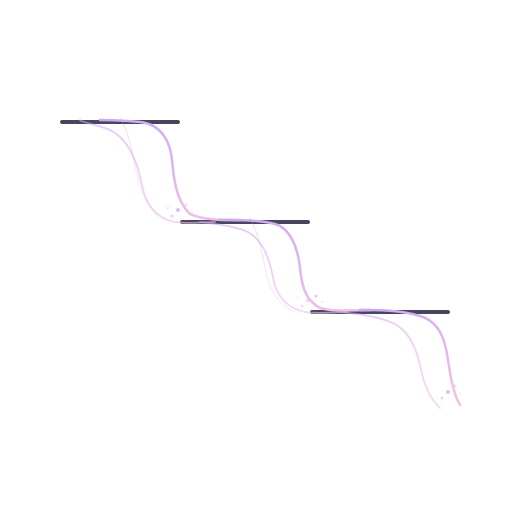
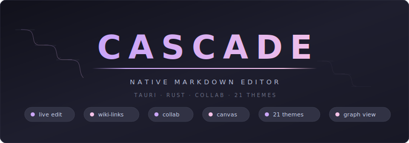
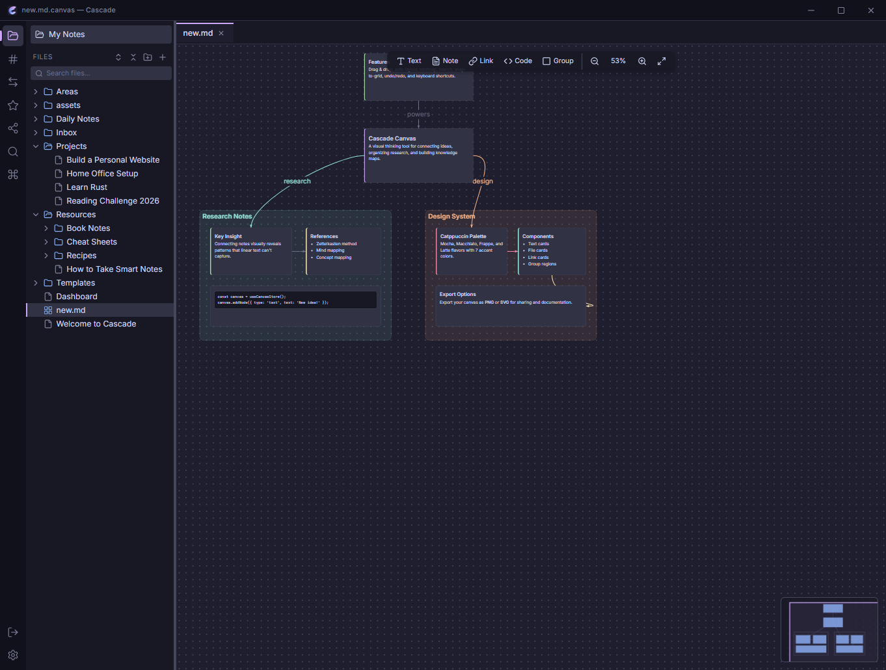
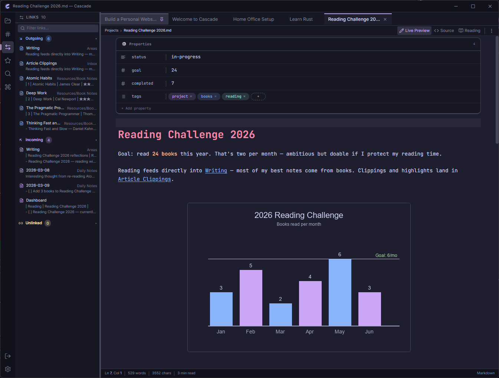
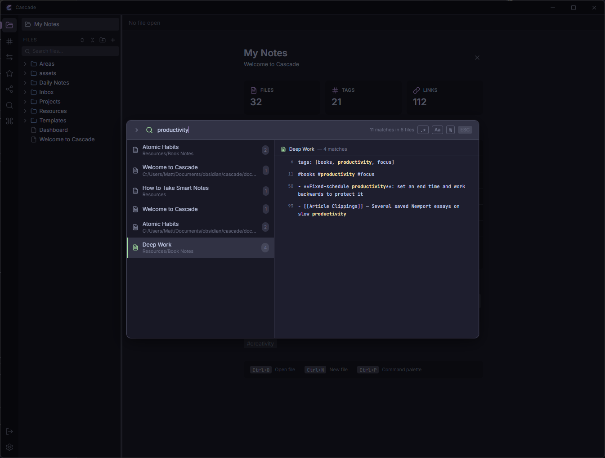
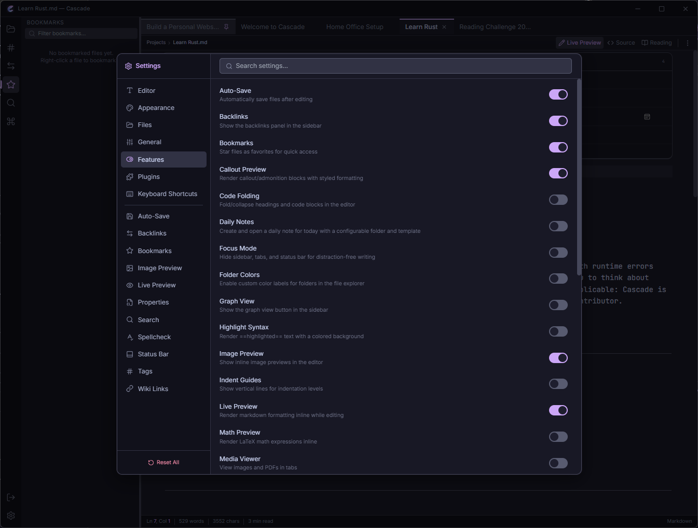
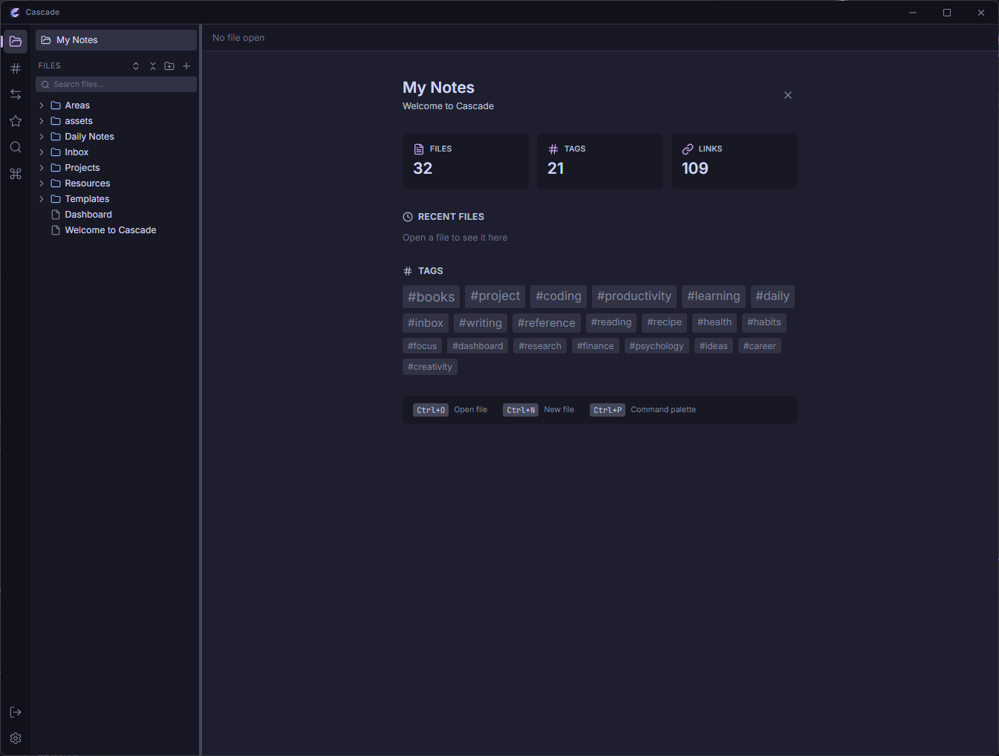

<div align="center">



# Cascade

Modern native markdown editor with real-time collaboration, live preview, wiki-links, canvas whiteboard, and 21+ themes — built with Tauri and Rust.

<p>
  <a href="https://github.com/Real-Fruit-Snacks/Cascade/releases"></a>
  <a href="https://github.com/Real-Fruit-Snacks/Cascade/blob/main/LICENSE"></a>
  <a href="https://github.com/Real-Fruit-Snacks/Cascade/actions/workflows/ci.yml"></a>
  <a href="https://github.com/Real-Fruit-Snacks/Cascade/stargazers"></a>
</p>

<p>
  <a href="#features">Features</a> &bull;
  <a href="#screenshots">Screenshots</a> &bull;
  <a href="#installation">Installation</a> &bull;
  <a href="#development">Development</a> &bull;
  <a href="#contributing">Contributing</a> &bull;
  <a href="#license">License</a>
</p>

</div>

<br />

<div align="center">
  
</div>

<br />

<p align="center">
  
</p>

---

## Features

### Editor

- **Live Preview, Source, and Reading** view modes with seamless switching
- **CodeMirror 6** with syntax highlighting, code folding, bracket matching, and line numbers
- **Wiki-links** (`[[note]]`) with autocomplete, backlink tracking, and heading links
- **Slash commands** — type `/` to insert headings, code blocks, callouts, tables, and more
- YAML frontmatter properties editor with type indicators
- Inline image preview with resize and alignment controls
- Math (LaTeX) block preview and Mermaid diagram rendering
- Callout blocks (`> [!NOTE]`, `> [!WARNING]`, etc.)
- Table editor with column/row manipulation
- Tags with autocomplete, nested tag support, and tag panel
- Highlight syntax (`==highlighted==`)
- Find and replace across notes (`Ctrl+Shift+F`)
- Spellcheck with custom dictionary support
- Optional Vim mode
- Smart lists (auto-continue bullets, tasks, numbered lists)
- Indent guides with customizable style and color
- Embed preview for transclusion (`![[note]]`)
- Query/Dataview-like preview blocks

### Real-Time Collaboration

- **Live collaborative editing** for shared folder vaults — multiple users edit simultaneously
- Live cursors and selections with user colors
- Collaborators sidebar panel showing who is editing what
- File tree presence dots showing active collaborators per file
- Auto host election with presence file discovery — zero config, just open the same vault
- Password-protected sessions (never saved to disk, Argon2 hashed)
- Automatic host promotion on disconnect
- Collab-aware file operations — rename/delete events sync across all users
- Settings profiles for per-user preferences when sharing a vault

### Canvas Whiteboard

- **Infinite canvas** for visual thinking with pan, zoom, and snap-to-grid
- Text, file, and link cards with markdown rendering
- Connect cards with edges (arrows, labels, colors, line styles)
- Group nodes for organizing related cards
- Auto-layout (grid, tree, force-directed), alignment, and distribution
- Canvas search, minimap, and export to PNG or SVG
- Undo/redo, copy/paste, duplicate, lock/unlock nodes
- `.canvas` file format compatible with Obsidian

### Focus & Writing

- Focus mode with paragraph dimming
- Typewriter mode (keeps current line centered)
- Word count goals with progress tracking
- Auto-save with timer and focus-change modes
- Split panes for side-by-side editing
- Status bar (word count, character count, reading time, selection info)

### Knowledge Management

- **Backlinks panel** showing all notes that link to the current note
- **Graph view** visualizing connections between notes
- Tag index with tag panel for browsing and renaming
- Bookmarks for quick access to frequently used notes
- Outline panel for heading navigation
- Table of contents generation
- Daily, weekly, monthly, quarterly, and yearly notes with templates

### Organization

- Vault-based file management with folder tree
- Quick Open (`Ctrl+O`) for fast file switching
- Command Palette (`Ctrl+P`) with 40+ commands and keyboard shortcuts
- Drag-and-drop file reorganization
- File properties dialog (word count, character count, backlinks, tags)
- Template system with variable replacement and custom delimiters
- Folder colors with multiple display styles
- GitHub sync for vault backup and collaboration

### Import & Export

- Import from **Obsidian, Notion, Bear, Roam Research**, and plain markdown
- Export to **Markdown, HTML, or PDF**
- Batch export with customizable options

### Customization

- **21+ built-in themes**: Catppuccin (Mocha, Macchiato, Frappe, Latte), Nord, Dracula, Gruvbox, Tokyo Night, One Dark, Solarized, Rose Pine, GitHub, Monokai, Material, Night Owl, Ayu, Kanagawa, Everforest
- Custom theme support via JSON with visual card picker
- Configurable fonts (UI and editor), font sizes, and line height
- Plugin system with sandboxed iframe execution and marketplace
- 30+ configurable feature toggles with per-feature option pages
- Customizable keyboard shortcuts
- Internationalization ready (i18next, 2200+ keys)

### Performance & Security

- **Native desktop app** — no Electron, no browser overhead
- Rust backend for file I/O with canonical path validation and traversal protection
- Collaboration server binds to localhost with Argon2 password hashing
- Plugin HTML sandboxed with restrictive CSP; asset protocol scoped to user documents
- CI pipeline with SHA-pinned actions, cargo clippy, and npm audit
- Files stay on your disk — no cloud dependency
- Lazy-loaded components and namespaced i18n bundles
- Deep link support (`cascade://open/vault/note`)

## Screenshots

<details>
<summary>Canvas Whiteboard</summary>

</details>

<details>
<summary>Graph View</summary>

</details>

<details>
<summary>Backlinks Panel</summary>

</details>

<details>
<summary>Vault Search</summary>

</details>

<details>
<summary>Quick Open</summary>

</details>

<details>
<summary>Find & Replace</summary>

</details>

<details>
<summary>Command Palette</summary>

</details>

<details>
<summary>Settings — Appearance</summary>

</details>

<details>
<summary>Settings — Features</summary>

</details>

<details>
<summary>Settings — Editor</summary>

</details>

<details>
<summary>Settings — Keyboard Shortcuts</summary>

</details>

<details>
<summary>Welcome View</summary>

</details>

## Installation

### Pre-built Binaries

Download the latest release for your platform from the [Releases](https://github.com/Real-Fruit-Snacks/Cascade/releases) page.

| Platform | Download | Format |
|----------|----------|--------|
| Windows  | [Latest Release](https://github.com/Real-Fruit-Snacks/Cascade/releases) | `.msi` installer |
| macOS    | [Latest Release](https://github.com/Real-Fruit-Snacks/Cascade/releases) | `.dmg` disk image |
| Linux    | [Latest Release](https://github.com/Real-Fruit-Snacks/Cascade/releases) | `.AppImage` / `.deb` |

### Build from Source

**Prerequisites:**
- [Node.js](https://nodejs.org/) 18+
- [Rust](https://rustup.rs/) 1.70+
- [Tauri CLI](https://tauri.app/start/prerequisites/)

```bash
# Clone the repository
git clone https://github.com/Real-Fruit-Snacks/Cascade.git
cd cascade

# Install dependencies
npm install

# Run in development mode
npm run tauri dev

# Build for production
npm run tauri build
```

## Development

### Project Structure

```
cascade/
├── src/                  # React frontend
│   ├── components/       # UI components
│   ├── stores/           # Zustand state stores
│   ├── hooks/            # Custom React hooks
│   ├── i18n/             # Internationalization config
│   ├── locales/en/       # English translation files
│   ├── editor/           # CodeMirror extensions
│   ├── lib/              # Utility functions
│   └── plugin-api/       # Plugin sandbox system
├── src-tauri/            # Rust backend
│   └── src/
│       ├── main.rs       # Tauri entry point
│       ├── commands.rs   # IPC command handlers
│       └── error.rs      # Error types
├── tests/e2e/            # Playwright E2E tests
└── docs/                 # Documentation & assets
```

### Tech Stack

| Layer    | Technology |
|----------|-----------|
| Runtime  | [Tauri v2](https://tauri.app/) (Rust + WebView) |
| Frontend | [React 19](https://react.dev/) + TypeScript |
| Editor   | [CodeMirror 6](https://codemirror.net/) |
| Styling  | [Tailwind CSS](https://tailwindcss.com/) |
| State    | [Zustand 5](https://zustand.docs.pmnd.rs/) |
| Collab   | [Yjs](https://yjs.dev/) (CRDT real-time sync) |
| i18n     | [react-i18next](https://react.i18next.com/) |
| Themes   | [Catppuccin](https://catppuccin.com/) + 17 more |
| Testing  | [Vitest](https://vitest.dev/) + [Playwright](https://playwright.dev/) |

### Running Tests

```bash
# Run unit tests
npm test

# Run unit tests in watch mode
npm run test:watch

# Start the app for E2E testing
npm run tauri dev

# Run E2E tests (requires app to be running)
npx playwright test
```

### Commands

| Command | Description |
|---------|------------|
| `npm run dev` | Start Vite dev server |
| `npm run build` | TypeScript check + Vite build |
| `npm run lint` | ESLint check |
| `npm test` | Run unit tests |
| `npm run tauri dev` | Start Tauri app in dev mode |
| `npm run tauri build` | Build production binaries |

## Keyboard Shortcuts

| Shortcut | Action |
|----------|--------|
| `Ctrl+O` | Quick Open |
| `Ctrl+P` | Command Palette |
| `Ctrl+N` | New File |
| `Ctrl+S` | Save |
| `Ctrl+W` | Close Tab |
| `Ctrl+Tab` | Next Tab |
| `Ctrl+Shift+F` | Search in Vault |
| `Ctrl+,` | Settings |
| `Ctrl+B` | Toggle Sidebar |
| `Ctrl+F` | Find in File |
| `Ctrl+H` | Find and Replace |
| `Ctrl+Shift+C` | New Canvas |
| `Alt+D` | Open Daily Note |
| `Ctrl+Z` | Undo |
| `Ctrl+Shift+Z` | Redo |

## Contributing

Contributions are welcome! Please see [CONTRIBUTING.md](CONTRIBUTING.md) for guidelines on how to get involved.

## Security

To report a vulnerability, please see [SECURITY.md](SECURITY.md).

## License

[MIT](LICENSE) &copy; 2026 [Real-Fruit-Snacks](https://github.com/Real-Fruit-Snacks)
