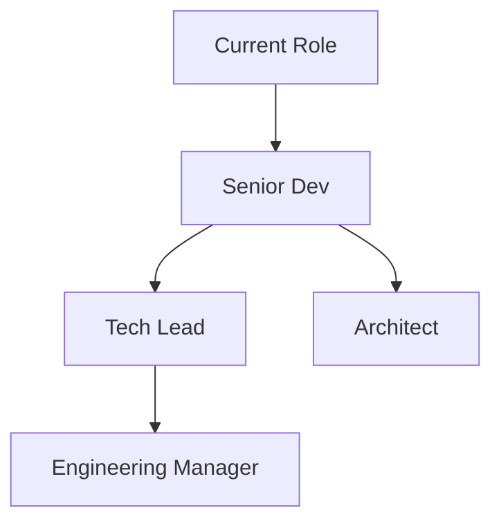

# Career Development

Long-term career planning and skill growth. The goal is to be intentional rather than reactive — choosing depth over breadth and building toward a clear technical identity.

## Career Vision

I want to be a trusted technical leader who can both write excellent code and help teams do the same. The path runs through deep technical mastery first, then gradually expanding into architecture and people leadership. Reading [[The Pragmatic Programmer]] and [[Deep Work]] has shaped a lot of this thinking.

## Career Roadmap

## Skills to Develop

### In Progress
- **Rust** — working through [[Learn Rust]]; building small CLI tools to reinforce concepts
- **System design** — reading architecture case studies, practicing on paper
- **Technical writing** — documenting decisions clearly, writing ADRs

### On Deck
- Distributed systems fundamentals (consensus, CAP theorem)
- Data engineering basics (pipelines, streaming)
- Public speaking / conference talks

### Ongoing
- TypeScript / React — keep sharp through Cascade project
- Code review skills — giving and receiving feedback well

## Networking

Being intentional about this rather than transactional. Key habits:

- Monthly coffee chats with 1–2 people outside my immediate team
- Engage genuinely on technical blogs and GitHub discussions
- Write at least one post per quarter — ties into [[Build a Personal Website]]
- Attend 1–2 local meetups or conferences per year

## Goals for 2026

| Goal                              | Target Date | Status      |
| --------------------------------- | ----------- | ----------- |
| Complete Rust learning path       | Q2 2026     | In progress |
| Launch personal website           | Q1 2026     | Planning    |
| Lead one significant project end-to-end | Q3 2026 | Not started |
| Read 4 technical books            | Dec 2026    | 1/4 done    |
| Contribute to one open source project | Q4 2026 | Not started |

## Reading & Resources

- [[The Pragmatic Programmer]] — evergreen fundamentals
- [[Deep Work]] — focus and output quality
- [[Learn Rust]] — current technical study
- [[Build a Personal Website]] — public presence and writing practice

> "Your most important professional asset is your reputation for being someone who gets things done — and who you can trust." — pragmatic wisdom

#career #learning
